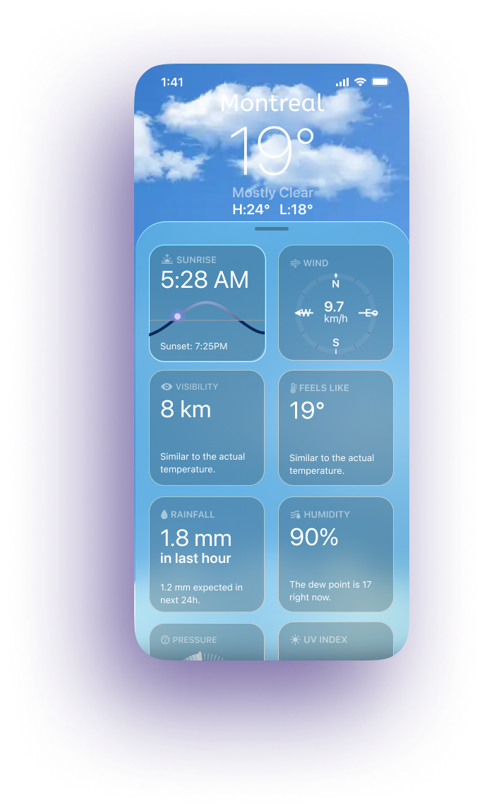
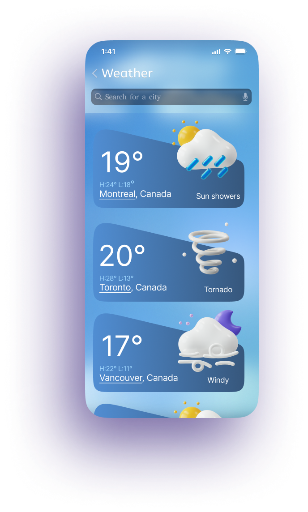
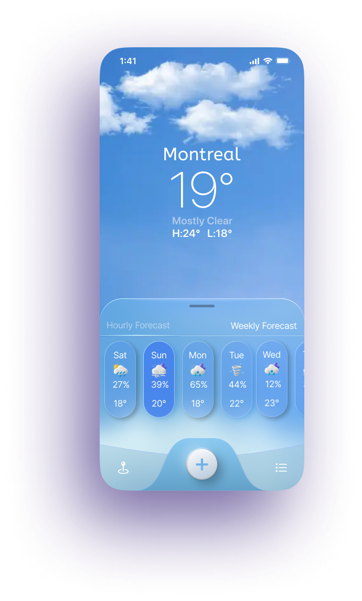

WeatherApp UX/UI
=================

Showcase of the WeatherApp interface design. Below are exported screens, list cards, radar/heatmap views, and settings UI.

Screens
-------

Search flow

Cards (List)
------------

Maps (Radar / Heat)
-------------------

Settings
--------

Repository structure
--------------------

- `assets/screens`: full-screen UI shots
- `assets/cards`: list/card previews
- `assets/maps`: radar/heatmap views
- `assets/settings`: settings pages

License
-------

All images are provided for showcasing design work. Do not reuse without permission.

